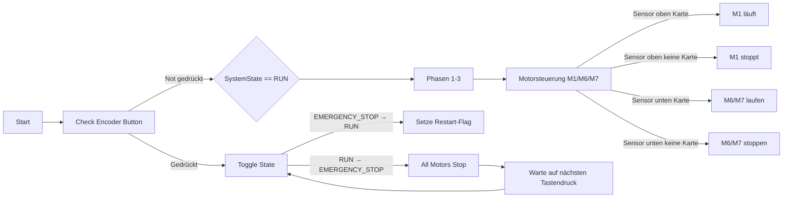

## Ziel

**Ziel**: Du willst dein System auch ohne funktionierendes Display sicher steuern können:

- **Drehgeber-Drucktaste**: Soll sowohl einen **echten Not-Stopp** (alle Motoren sofort aus, Ablauf unterbrechen) als auch eine **Pause-Funktion** ermöglichen.
- **Zwei Kartensensoren (Lichtschranken)**: Oben beim Trichter/M1 und unten bei M6/M7 sollen abhängig von "Karte drauf" / "keine Karte" die jeweiligen Motoren starten bzw. stoppen.
- Die eigentliche Menü-/Encoder-Logik (Drehung) soll im Code erhalten bleiben, aber deaktiviert/auskommentiert werden, solange das Display nicht funktioniert.

---

## Architektur-Überblick

- **Dateien im Fokus**:
  - [Core/Src/main.c](Core/Src/main.c): Systemeinstieg, Initialisierung von Timern, GPIOs, und der bisherigen Phasenlogik `Phase1_Sortieren_1Minute`, `Phase2_Transport_1Minute`, `Phase3_Auswurf`.
  - [Core/Src/motor_logic.c](Core/Src/motor_logic.c) (angenommen): Enthält Funktionen zur Ansteuerung der Motoren M1–M7 und Stepper.
  - [Core/Src/lichtschranke_logic.c](Core/Src/lichtschranke_logic.c) (angenommen): Enthält Logik zum Auslesen der Lichtschranken (Sensoren).
  - [Core/Inc/main.h](Core/Inc/main.h), [Core/Inc/motor_logic.h](Core/Inc/motor_logic.h), [Core/Inc/lichtschranke_logic.h](Core/Inc/lichtschranke_logic.h): Deklarationen für globale Zustände und APIs.
- **Hardware-Signale laut `main.c**` (GPIO-Konfiguration):
  - Kartensensoren/Lichtschranken:
    - `Lichtschranke_1_Sig_Pull_Up_Pin` (GPIOA, Pull-Up)
    - `Lichtschranke_2_Sig_Pull_Up_Pin` (GPIOC, Pull-Up)
    - `Lichtschranke_3_Sig_Pull_Up_Pin` (GPIOA, Pull-Up)
    - `Lichtschranke_4_Sig_Pull_Up_Pin` (GPIOC, Pull-Up)
  - Drehgeber-Taste:
    - `ENC_SW_Pin` auf `GPIOC` mit Pull-Up (Taster nach GND aktiv).
  - Motorpins: z.B. `M1_SchieberOben_IN1_M1_DIR_Pin`, `M1_SchieberOben_IN2_M1_DIR_Pin`, `M6_WelleUnten_IN3_Pin`, `M7_SchieberUnten_IN1_Pin`, usw.
- **Steuer-Philosophie**:
  - Wir führen einen globalen **Systemzustand** ein, z.B. `SYSTEM_RUN`, `SYSTEM_PAUSE`, `SYSTEM_EMERGENCY_STOP`.
  - Die Drehgeber-Taste toggelt zwischen den Zuständen:
    - **RUN → EMERGENCY_STOP**: Sofort alle Motoren aus, alle laufenden Phasen/Loops verlassen.
    - **EMERGENCY_STOP → RUN (Neustart)**: Phasenablauf fängt wieder bei Phase 1 an.
    - Optional: **RUN ↔ PAUSE**: Saubere Pause, bei der Motoren ausgehen, aber beim Fortsetzen der gleiche Programmpunkt wieder aufgenommen wird (nur wenn wir es explizit benötigen; zunächst konzentrieren wir uns auf den harten Stopp + Neustart).
  - Die **zwei Kartensensoren** werden als zusätzliche Bedingungen in die Motorlogik eingebaut:
    - Oben (Trichter / M1-Bereich): Nur wenn `sensor_oben_karte == true`, dürfen M1 (und evtl. zugehörige Motoren für diese Stufe) laufen, sonst sofort stoppen.
    - Unten (M6/M7-Bereich): Nur wenn `sensor_unten_karte == true`, dürfen M6 und M7 laufen, sonst sofort stoppen.

---

## Geplante Änderungen im Detail

### 1. Globalen Systemzustand und Encoder-Taster-Handling einführen

- **In `main.h**`:
  - Einen neuen `enum` oder `typedef` für den Systemzustand definieren, z.B.:
    - `typedef enum { SYSTEM_RUN = 0, SYSTEM_PAUSE, SYSTEM_EMERGENCY_STOP } SystemState_t;`
  - Eine globale Variable deklarieren, z.B. `extern volatile SystemState_t g_SystemState;`.
- **In `main.c**`:
  - Die Definition von `g_SystemState` ergänzen, initial z.B. `SYSTEM_RUN` oder `SYSTEM_EMERGENCY_STOP` (abhängig davon, ob das System beim Einschalten erst nach Tastendruck starten soll).
  - Eine Hilfsfunktion schreiben, z.B. `void Check_Encoder_Button(void);`, die regelmäßig (z.B. in der Haupt-While-Schleife und/oder in den Phasenfunktionen) aufgerufen wird.
  - Diese Funktion:
    - Liest den Pin `ENC_SW_Pin` ein (wegen Pull-Up aktiv bei Low).
    - Entprellt mit einfacher Logik (z.B. kurzer Delay oder Vergleich mit altem Zustand).
    - Implementiert die Zustandsübergänge:
      - Wenn Taster gedrückt und aktueller Zustand `SYSTEM_RUN`: → `SYSTEM_EMERGENCY_STOP`, ruft `All_Motors_Stop_Immediate();` auf.
      - Wenn Taster gedrückt und aktueller Zustand `SYSTEM_EMERGENCY_STOP`: → `SYSTEM_RUN` und setzt ein Flag, dass beim nächsten Durchlauf die Phasen neu von vorn gestartet werden (z.B. `g_RestartFromPhase1 = 1;`).
    - Optional: Übergänge für `SYSTEM_PAUSE`, falls wir später eine reine Pause von einem harten Not-Stopp unterscheiden wollen.
- **Warum so?**
  - Dadurch musst du die Not-Stopp-Logik nur **an wenigen zentralen Stellen abfragen** (Phasen und Motorfunktionen) und nicht überall im Code durcheinander mischen.

---

### 2. Zentrale Motor-Stopp-Funktion implementieren

- **In `motor_logic.h**`:
  - Prototyp hinzufügen: `void All_Motors_Stop_Immediate(void);`
- **In `motor_logic.c**`:
  - `All_Motors_Stop_Immediate` implementieren, die alle relevanten Motor-Pins für M1–M7 und evtl. den Stepper in einen sicheren Stopp-Zustand bringt (z.B. beide Richtungs-/Enable-Pins Low, damit Motorentreiber keine Kraft ausüben).
  - Ggf. vorhandene Stop-/Reset-Funktionen wiederverwenden, falls es bereits einzelne `Stop_Mx()` Funktionen gibt.
- **Anwendungsorte**:
  - Wird direkt in der Encoder-Taster-Logik (Punkt 1) aufgerufen.
  - Kann auch innerhalb von Sensor-Schutzlogik (Punkt 3) verwendet werden.

---

### 3. Sensor-Logik für oben/unten in die Motorsteuerung einbauen

- **Annahme**: Die Lichtschranken sind so verschaltet, dass durch den **Pull-Up** ein "kein Karte"-Zustand High ergibt und "Karte drauf / unterbrochen" Low.
- **In `lichtschranke_logic.h**`:
  - Funktionen deklarieren wie:
    - `bool Sensor_Oben_Hat_Karte(void);`  // z.B. verwendet `Lichtschranke_1` oder `2`, je nach deiner Verdrahtung
    - `bool Sensor_Unten_Hat_Karte(void);` // z.B. verwendet `Lichtschranke_3` oder `4`
- **In `lichtschranke_logic.c**`:
  - Implementierung anhand der richtigen Pins, z.B.:
    - `return (HAL_GPIO_ReadPin(Lichtschranke_X_GPIO_Port, Lichtschranke_X_Pin) == GPIO_PIN_RESET);`  // Karte vorhanden
  - Wichtig ist hier nur die saubere Kapselung; du kannst intern leicht ändern, welchen Pin du nutzt, ohne den Rest des Codes anzupassen.
- **Integration in Motorlogik**:
  - In den Funktionen, die die Motoren **M1** (oben) sowie **M6/M7** (unten) ansteuern, die Sensorbedingung einbauen, z.B.:
    - Vor Start von M1: `if (Sensor_Oben_Hat_Karte() && g_SystemState == SYSTEM_RUN) { M1_Start(); } else { M1_Stop(); }`
    - Während Lauf von M1: In der Lauf-Schleife regelmäßig prüfen, ob `Sensor_Oben_Hat_Karte()` noch `true` ist, sonst stoppen.
    - Analog für M6/M7 mit `Sensor_Unten_Hat_Karte()`.
  - So wird sichergestellt:
    - **Wenn Karte drauf → Motor läuft** (solange System nicht im Not-Stopp/Pause ist).
    - **Wenn keine Karte → Motor stoppt sofort**.

---

### 4. Phasenfunktionen (Phase1/2/3) mit Systemzustand und Sensoren kombinieren

- **In `motor_logic.c` oder `menu_logic.c` (wo `Phase1_Sortieren_1Minute`, `Phase2_Transport_1Minute`, `Phase3_Auswurf` implementiert sind)**:
  - Jede Phase verwendet üblicherweise Schleifen (Zeitschleife oder Stückzahl). Dort bauen wir zwei zusätzliche Checks ein:
    1. **Systemzustand beachten**:
      - Innerhalb der Schleifen regelmäßig prüfen:
        - `if (g_SystemState == SYSTEM_EMERGENCY_STOP) { All_Motors_Stop_Immediate(); return; }`
      - Für eine optionale Pause kann ähnlich verfahren werden: In `SYSTEM_PAUSE` die Motoren anhalten und in einer inneren Warte-Schleife bleiben, bis wieder `SYSTEM_RUN` erreicht ist.
    2. **Sensoren beachten** (nur für Phasen, in denen M1 bzw. M6/M7 relevant sind):
      - Beim Ansteuern der entsprechenden Motoren jeweils die Sensorfunktionen nutzen (wie in Punkt 3 beschrieben).
- **In `main.c` Haupt-While-Schleife**:
  - Vor Start der Phasen prüfen:
    - Wenn `g_SystemState == SYSTEM_EMERGENCY_STOP`, nicht in die Phasen springen, sondern auf Taster warten, bis wieder `SYSTEM_RUN` gesetzt wurde.
    - Wenn ein Neustartflag `g_RestartFromPhase1` gesetzt ist, die Phasen von vorne laufen lassen.
  - Während `while(1)` kann regelmäßig `Check_Encoder_Button();` aufgerufen werden (zusätzlich zu den Aufrufen innerhalb der Phasen), um auch außerhalb von Phasen auf Tastereingaben reagieren zu können.
- **Ohne Display (`DISPLAY_ENCODER_CONNECTED == 0`)**:
  - Falls du testweise ohne Display arbeitest, können wir eine minimalistische Version der Taster-/Sensorlogik im `#else`-Teil implementieren, die direkt mit den Phasen arbeitet, ohne Menüfunktionen.

---

### 5. Menü-/Encoder-Rotationscode vorübergehend deaktivieren, aber erhalten

- In `main.c` und `menu_logic.c`:
  - Den Code, der die Drehgeber-Drehung (links/rechts) für die Menüführung/Spieleranzahl nutzt, **nicht löschen**, sondern per `#if 0 ... #endif` oder Kommentarblöcken temporär deaktivieren.
  - Die Display-Initialisierung (`Menu_Init`, `Menu_Wait_For_Start`, `Menu_Select_Player_Count`, `Menu_Show_Message`) kann weiter im Code verbleiben; wenn das Display physisch nicht angeschlossen oder defekt ist, wird es zwar nicht anzeigen, aber die Logik bleibt konsistent für später.
  - Wichtig: Darauf achten, dass keine Display-Funktionen blockierend warten, wenn kein Bild sichtbar ist (z.B. `Menu_Wait_For_Start` darf nicht auf einen Tastendruck warten, den du aktuell anders verwendest).

---

### 6. Sicherheitsaspekte und Tests

- **Sicherheit**:
  - Prüfen, dass `All_Motors_Stop_Immediate` wirklich alle Ausgänge in einen sicheren Zustand bringt (keine ungewollte Richtung/Enable aktiv).
  - Sicherstellen, dass bei `SYSTEM_EMERGENCY_STOP` nirgendwo im Code mehr Motor-Start-Befehle passieren, bevor explizit wieder auf `SYSTEM_RUN` geschaltet wurde.
- **Tests (ohne Display)**:
  1. Board einschalten, Taster unbetätigt lassen → System sollte im definierten Startzustand bleiben.
  2. Taster drücken → System geht in `SYSTEM_RUN`, Phase 1 startet, M1 läuft **nur**, wenn oben eine Karte am Sensor ist.
  3. Karte oben entfernen → M1 stoppt.
  4. Karte unten: Prüfen, dass M6/M7 nur bei vorhandener Karte laufen.
  5. Während irgendeiner Phase Taster drücken → sofortiger Not-Stopp, alle Motoren aus.
  6. Taster erneut drücken → Phasen laufen von vorne (Phase 1) an.

---

## Kurzer Merkmals-Flow (Mermaid)

---

## Zusammenfassung

- **Systemzustand** (RUN/PAUSE/EMERGENCY_STOP) wird global eingeführt und per Drehgeber-Taste umgeschaltet.
- **Not-Stopp**: Sofortige Abschaltung aller Motoren über eine zentrale Funktion, Abbruch der Phasen.
- **Neustart**: Nach erneutem Tastendruck laufen die Phasen von vorne an.
- **Sensoren oben/unten** steuern, ob M1 bzw. M6/M7 laufen dürfen; bei fehlender Karte stoppen die Motoren automatisch.
- Die bestehende Menü-/Encoder-Rotationslogik bleibt im Code erhalten, wird aber vorübergehend deaktiviert, bis dein Display wieder funktioniert.

